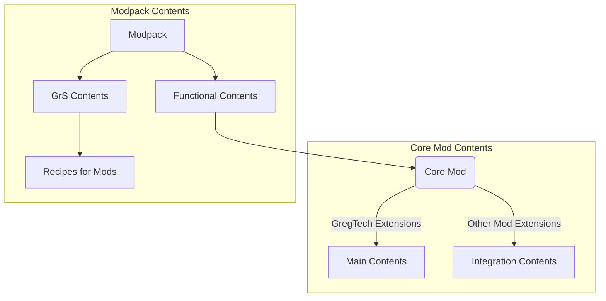

<p style="text-align:center;">
  
</p>

# :strawberry: GregTech Lite Core

The Spiritual Successor of **[Gregicality Legacy](https://github.com/GregTechCEu/gregicality-legacy)**.

## :mag: Table of Contents

[[_TOC_]]

## :bookmark_tabs: Introduction

**GregTech Lite Core** is an Addition Mod for **[GregTech CEu](https://github.com/GregTechCEu/GregTech)**,
and as the Core Mod of Modpack **[GregTech Lite](https://www.mcmod.cn/modpack/655.html)**. This mod is wrote by *Kotlin language*, so it is hard-dependencied with **[Forgelin](https://github.com/ChAoSUnItY/Forgelin-Continuous)**.

## :books: Features

>>> [!note] For Gameplay
- Completed all endgame stages (from *Ultra High Voltage* to *Maximum Voltage*), referenced **[GregTech 5 Unofficial](https://github.com/GTNewHorizons/GT5-Unofficial)** and **[Gregicality Legacy](https://github.com/GregTechCEu/gregicality-legacy)**.
- Friendly and Powerful Large Multiblocks for all GregTech RecipeMaps, instanceof machines in **[Gregicality Multiblocks](https://github.com/GregTechCEu/gregicality-multiblocks)**.
- Earlygame and midgame contents rebalancing, add more chemistry processings for *Growth Medium*, *Platinum Group Elements*, *Rare Earth Elements*, e.t.c.
- A huge amount of recipes simplifications, consists of:
  - Iron ingot can smelt to *Wrought Iron* ingot now.
  - Reduced duration comsumption of water electrolysis.
  - Down-tier clay electrolysis from MV to LV.
  - Buff all circuit produce amounts, each processor produce 4x now, and subsequent decrease in sequence (4,3,2,1) in Circuit Assembler.
  - Down-tier *Plasma Turbine* from LuV to IV.
  - Reduced duration/energy consumption of all Assembly Line recipes, higher components have cheaper recipes now.
  - Rubber parts are unified in all components recipes, e.g. LuV Electric Pump and Conveyor Module can use all synthetic rubbers now.

>>>

>>> [!important] For Development
- More primitive type and functional programming interfaces supported.
  - Add some primitive type versions of consumers, predicates and functions.
  - Add functors, bifunctors and its related implementations.
- Apache tuples enhancement, add more list operations and functional operations.
- Java 9 Feature "**StackWalker**" port for Java 8 and its kotlin extension.
- Java 21 Feature "**Sequenced Collection**" port for Java 8.
- Java 24 Feature "**Gatherer API**" port for Java 8:
  - The stream start point of gatherer and some implementation methods.
  - More advanced operations like `zipWithIndex` for gatherer.
- Stream and StreamEx enhancements, provided more advanced operations.
>>>

## :crystal_ball: Functional Overview

### :wrench: Total Structure of Modpack and Core Mod


### :speech_balloon: Module Structure of Core Mod
```mermaid
graph TB

Node1[IModuleContainer] -- Impl --> Node2[ModuleContainer]

Node2[ModuleContainer] -- Container Impl --> Node4[ModuleManager]

Node3[@Module] -- Processed In --> Node4[ModuleManager]

Node5[IModule] <-- Interface/Annotation --> Node3[@Module]

Node6[IModuleManager] -- Impl --> Node4[ModuleManager]

Node5[IModule] -- Impl --> Node7[BaseModule]
Node5[IModule] -- Impl --> Node8[CoreModule]

Node8[CoreModule] <-- Sided Proxies Entrust--> Node9[GTLiteMod]

Node7[BaseModule] -- Impl --> Node10[IntegrationSubModule]

Node10[IntegrationSubModule] -- Extd --> Node11[All Integration Modules]

Node8[CoreModule] --> Node12[All Mod Contents]
```

## :triangular_flag_on_post: License

- GregTech Lite Core
  - Copyright (c) Magic_Sweepy
  - [](http://www.apache.org/licenses/)
- GregTech Lite Modpack
  - Copyright (c) Magic_Sweepy
  - [](https://gitlab.com/gregtech-lite/gregtech-lite/-/blob/main/license)
- Texts, Translations and Questbook contents
  - Copyright (c) Magic_Sweepy
  - [](https://creativecommons.org/licenses/by-nc-sa/3.0/)
- Independently copyrighted Textures and Models
  - Copyright (c) Magic_Sweepy and U.M.T
  - [](https://creativecommons.org/licenses/by-nc-sa/3.0/)

## :coffee: Credits

Thanks for all the credit authors, it's your hard work that has brought about these wonderful contents:

- Dynamic circuits textures, infinity, cosmic neutronium, halkonite steel, space time and eternity textures, some multiblock structures, some machine overlay textures, Power IC textures, Space Elevator multiblock, Component Assembly Line multiblock, e.t.c, are from [GT5u](https://github.com/GTNewHorizons/GT5-Unofficial),
  this mod is on [GNU LGPL-3.0 License](https://github.com/GTNewHorizons/GT5-Unofficial/blob/master/LICENSE.txt).
- Laser textures, Nanoscale Fabricator overlay textures, Burner Reactor and Cryogenic Reactor overlay textures, a part of laminator and loom overlay textures, Rolling Pin textures and Crucible textures, Bedrock Drilling Rig multiblock are from [GregTech 6](https://github.com/GregTech6/gregtech6),
  this mod is on [GNU GPL-3.0 License](https://github.com/GregTech6/gregtech6/blob/master/LICENSE).
- Circuit board textures, higher SMD textures, CVD Unit multiblock structures and some overlay textures, recipe maps and chemistry processings are from [Gregicality Science](https://github.com/GregTechCEu/gregicality-science), 
  this mod is on [MIT License](https://github.com/GregTechCEu/gregicality-science/blob/master/LICENSE).
- Some chemical processings, metal casing texture templates, fusion casing texture templates, Industrial Primitive Blast Furnace multiblock, Cosmic Ray Detector multiblock, several large machine structures are from [Gregicality Legacy](https://github.com/GregTechCEu/gregicality-legacy),
  this mod is on [GNU GPL-3.0 License](https://github.com/GregTechCEu/gregicality-legacy/blob/master/LICENSE).
- Tree textures, some food textures and machine textures, a part of world generator codes and machine logic codes are from [GregTechFoodOption](https://github.com/bruberu/GregTechFoodOption),
  this mod is on [GNU LGPL-3.0 License](https://github.com/bruberu/GregTechFoodOption/blob/master/LICENSE.txt).
- Vertex Buffer Objects (VBO), quads, some JOML extends utilities and some renderer codes are from [GTNHLib](https://github.com/GTNewHorizons/GTNHLib),
  this mod is on [GNU LGPL-3.0 License](https://github.com/GTNewHorizons/GTNHLib/blob/master/LICENSE.txt).
- Cosmic neutronium and infinity render textures, animation tooltips implementations and some OpenGL codes are from [Avaritia](https://github.com/Morpheus1101/Avaritia),
  this mod is on [MIT License](https://github.com/Morpheus1101/Avaritia/blob/master/README.md).
- CVD Unit overlay textures, a part of laminator and loom overlay textures, stone texture templates and material textures from [Supersymmetry](https://github.com/SymmetricDevs/Supersymmetry),
  this modpack is on [GNU LGPL-3.0 License](https://github.com/SymmetricDevs/Supersymmetry/blob/master-ceu/LICENSE).

Salute and thank all credit authors :)